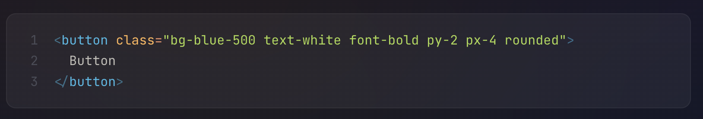
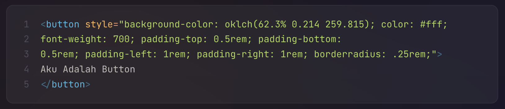
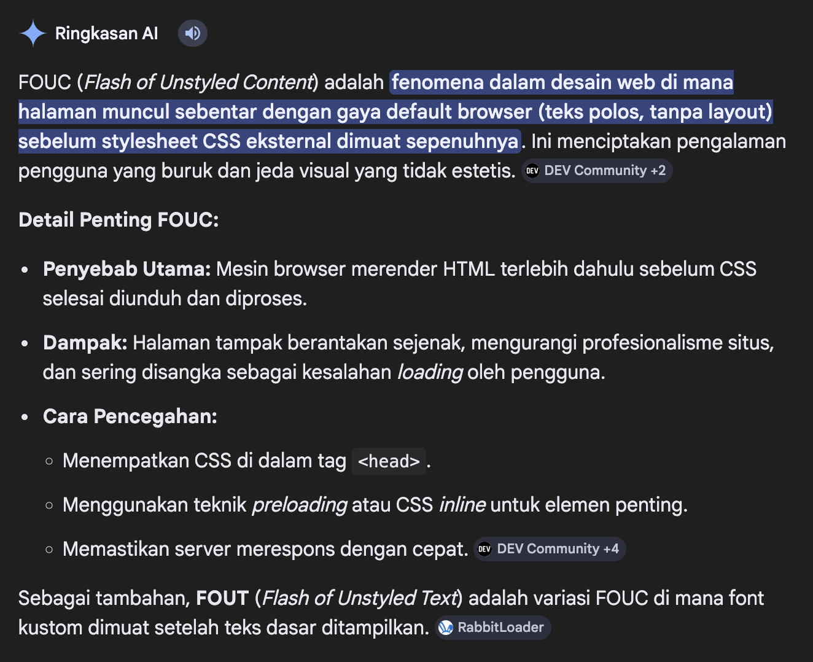
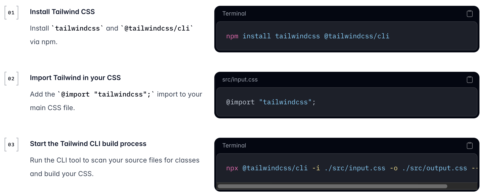
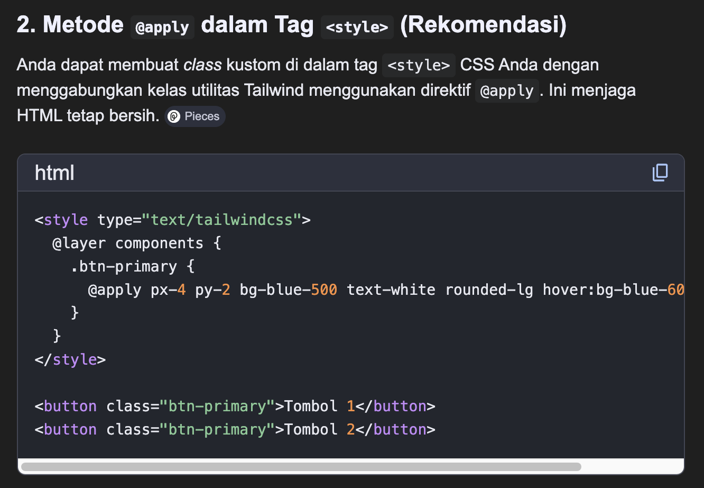

Ref:
- https://www.youtube.com/watch?v=ES5hlHdI4jc
- https://tailwindcss.com/docs/hover-focus-and-other-states#media-and-feature-queries
- https://dev.nauv.al/book/belajar-tailwind-v4

Apa aja yang dipelajari terkait TailwindCSS:
- Ternyata tailwind ini cuma menyediakan class-class kecil yang isinya css declaration. Berbeda dengan bootstrap, vuetify, atau komponen base lainnya. Di tailwind ini menyediakan deklarasi kecil seperti contohnya class `flex` itu isinya hanya css `display: flex` lalu `bg-red-500` itu mengacu ke background color berwarna merah menggunakan `oklch()`. Jadi konsep dari Tailwind ini adalah *utility-first-framework* berbeda dengan bootstrap yang mengacu ke *UI Kit CSS*.
- Di tailwind konsep penulisannya seperti *inline-style*, contohnya seperti berikut:

Contoh ketika menggunakan css murni:

- Ketika menggunakan tailwind melalui cdn, ketika project atau penggunaan class tailwind yang sudah banyak biasanya akan terjadi sedikit glitch yang mana styling yang sudah kita terapkan pada beberapa komponen ataupun pada markup html yang sudah di bangun terlihat seperti tidak menggunakan css. Setelah dicari tau itu adalah FOUC, berikut penjelasan dari google:

Itu semua terjadi karena tailwind hanya memperoses class-class yang digunakan saja.
- Secara proses tailwind hanya memperoses class-class yang digunakan saja, artinya class lain yang tidak digunakan namun telah di sediakan tailwind itu tidak dimasukkan kedalam hasil css yang kita gunakan. Ini baru dipelajari juga ketika menginstall tailwind menggunakan `Tailwind CLI`. Jadi caranya tailwind ini adalah build apapun yang digunakan di css. Hasil build tersebut yang akan digunakan untuk file html.

Jadi tiap kali ada perubahan pada html perlu di build ulang supaya style dari class yang dipakai ditambahkan ke file css hasil build. Untuk menanggulangi hal tersebut bisa menggunakan `--watch` supaya tidak perlu build ulang lagi tiap ada perubahan.
- Di tailwind juga bisa menggunakan custom styles, biasanya digunakan jika apa yang dibutuhkan tidak ada pada tailwind. Hal ini namanya `Arbitrary Values`. Seperti contoh misalkan kita mau membuat button dengan background `#0069FF`, maka alih-alih menggunakan `bg-blue-500` kita bisa menggunakan arbitrary values seperti ini `bg-[#0069FF]`.
- Penerapan *psuedo classes* di tailwind juga bisa inline dan terlihat mudah, contohnya `hover:style-perubahannya` untuk menerapkan style pada psuedo classes hover, atau seperti ini `hover:bg-blue-700`.
- Di tailwind kita bisa membuat css menjadi *reusable* conntohnya seperti ini:

Ini akan membuat class baru dengan nama `btn-primary` yang menerapkan beberapa class dari tailwind didalamnya.
Namun cara ini dirasa kurang baik karena ketika menggunakan `@apply` maka sebenarnya di belakang akan melakukan *generate* ulang pada masing-masing penggunaannya. Tidak seperti konsep dasarnya tailwind yaitu *utility-first* dan juga cara pemrosesannya yang hanya akan *generate* apa yang dibutuhkan saja. Dengan kata lain pembuatan *reuseable component* dengan metode `@apply` hanya akan membuat hasil build css nya menggendut saja. *Best practice* untuk membuat *reuseable component* adalah dengan menggunakan framework seperti React, Vue, ataupun Laravel.